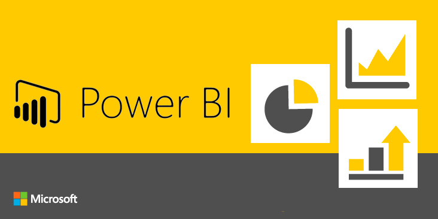

# **DQR – Data Quality Report**

*Portfólio Thiago Gonçalves Custódio*

## **Definição do Problema**

---

Necessidade de criação de Dashboards e Relatórios com indicadores chave de negócio para suporte a gestão, estratégia e tomada de decisão. Aqui exibiremmos diversos exemplos desenvovidos no Power BI Desktop, com a finlidade de demosntração de competência o quais não forão publicados.

**Informações sobre o DataSet:** Todos os DataSets aqui utilizados são fictícios, mas que podem representar a realidade.

Para visualizar a análise completa feita neste projeto, acesse este link:

* https://th14g0cust0d10.github.io/Projeto_DQR_Python/
